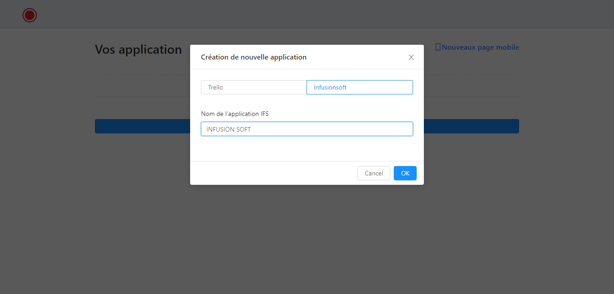
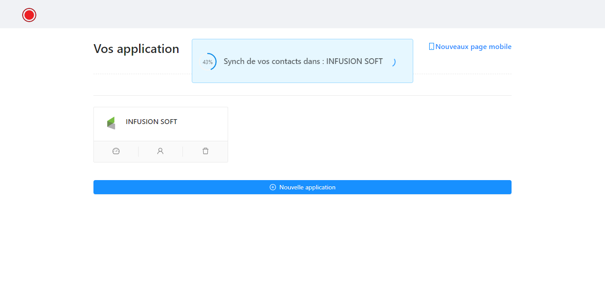
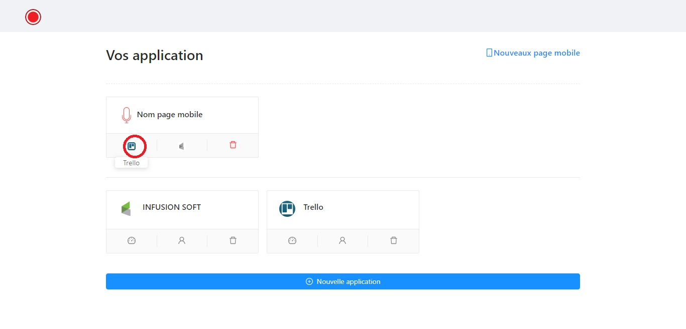
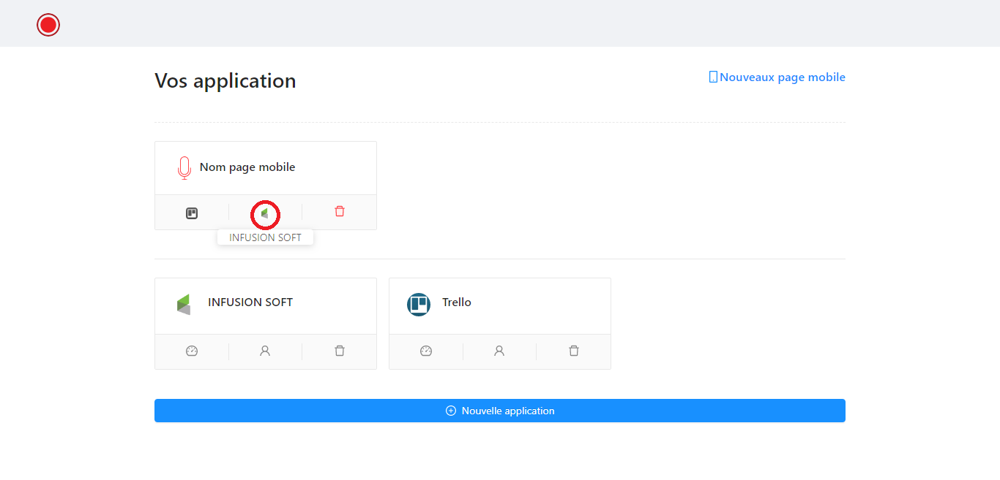

# Utilisation 
Pour utiliser l'extension chrome, il faut d'abord créé une application ( trello ou infusionsoft)
Pour créer une note mobile, il faut créé une application et après crée une page mobile 

## 1 - Création application 
Cliquer sur "nouvelle application" 
Remplir le formulaire. user le nom de votre choix 

Après vous serait redirigé vers le page d'authentification et demande d'autorisation après avoir validé, il vous sera nécessaire d'actualiser la page d'actuelle
+ si vous créez une application IFS, il synchronise automatiquement tous vos contacts IFS, il faut attendre la fin de ce chargement avant de continuer ( tout foix, si ce script est coupé, ça reprendra automatiquement aux prochaines connexions)

+ Vous pouvez maintenant utiliser l'extension chrome (2) ou crée une page mobile (3)

## 2 - Utilisation du plugin 
Pour utiliser l'extension, il faut créer préalablement crée une application. 
si l'icône est en noire, il faut que cliquer sur l'ICON et se reconnecter au serveur

## 3 - Création de page mobile 
Pour créer une depuis mobile, il faut créé une page mobile en cliquant sur "nouveaux pagent mobile"
NB : Vous pouvez en créer plusieurs en fonction de votre besoin ( vous avez plusieurs boards trello à utiliser donc vous crée plusieurs pages mobiles)
un formulaire s'affiche, après vous le rempliser
+ "Nom de la page" : nom de votre choix 
+ "Application trello a ratacher" : C'est l'application Trello que vous avez créée précédemment ( 2) donc vous utilisez à le donner de cette application
+ "Application IFS a ratacher" : C'est l'application IFS que vous avez créée précédemment ( 2) donc vous utilisez à le donner de cette application

NB : Je note que vous pouvez utiliser seulement 1 des 2 ( trello ou IFS) ou les deux 

### 3 - 1 - Paramétrage trello 
cliquer sur cette icône et vous peut paramétrer votre page

### 3 - 2 - Paramètrage IFS 
cliquer sur cette icône et vous peut paramétrer votre page

